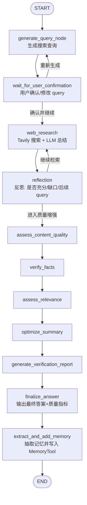

# My Deep Research Agent—上下文工程与深度研究实践

[](#)
[](#)
[](#)

一个基于 **LangGraph** 的“深度研究”智能体：

- **自动生成检索查询**（Query Generation）
- **Web Research**（Tavily Search）并产出带引用的综合总结
- **反思迭代**（Reflection Loop）：识别知识缺口、决定是否继续搜索
- **质量增强流水线**：内容质量评估、事实核验、相关性评估、摘要优化、验证报告
- **Memory / RAG 上下文构建**（基于 `hello_agents` 工具链）：
  - 从长期记忆中召回关键上下文
  - 从知识库进行检索增强（RAG）
  - 对对话历史做相关性过滤与压缩

---

## 目录

- [功能亮点](#功能亮点)
- [效果概览](#效果概览)
- [技术栈](#技术栈)
- [项目架构](#项目架构)
- [项目结构](#项目结构)
- [快速开始](#快速开始)
- [配置说明（环境变量）](#配置说明环境变量)
- [常见问题](#常见问题)
- [致敬](#致敬)
- [作者](#作者)
- [许可协议](#许可协议)
- [免责声明](#免责声明)

---

## 功能亮点

- **可控的研究工作流**：用 LangGraph 把“生成查询 → 搜索 → 反思 → 质量增强 → 输出”显式编排。
- **上下文工程**：`MyContextBuilder` 会融合
  - System 指令
  - 记忆（task_state / related_memory）
  - RAG 知识库
  - 最近对话历史（并按 query 相关性过滤）
- **结构化输出**：查询生成、反思、记忆抽取等环节采用 structured output（`with_structured_output`）。
- **可扩展节点化设计**：每个能力都是一个 node，便于替换/插拔。

---

## 效果概览

核心入口：`backend/src/agent/graph.py` 中的 `MyDeepResearchAgent`。

运行后会经历：

1. 生成搜索 query（并等待用户确认/调整）
2. 进行 Web 检索与总结（带引用）
3. Reflection 判断是否需要继续检索
4. 质量增强流水线（质量评估 / 核验 / 相关性 / 摘要优化 / 验证报告）
5. 抽取可长期复用的记忆并写入 MemoryTool

---

## 技术栈

- **Python**：建议 3.10+（项目当前在 Windows 环境使用）
- **LangChain**：`langchain-core` / `langchain-openai`
- **LangGraph**：`StateGraph` + `InMemorySaver`（会话 checkpoint）
- **Web Search**：`langchain-tavily`（Tavily API）
- **hello_agents**：`MemoryTool` / `RAGTool` / `ContextConfig` / `ContextBuilder`
- **Prompt Engineering**：`backend/src/agent/prompts/*`
- **中文分词与检索辅助**：`jieba`、`rank-bm25`（用于历史对话片段相关性筛选）
- **其他**：`python-dotenv`、`pydantic`、`tiktoken`（token 粗计）

---

## 项目架构

### 1) LangGraph 工作流（核心）

> 入口：`MyDeepResearchAgent._build_graph()`



### 2) 上下文构建（MyContextBuilder）

`MyContextBuilder` 的职责是“把可用的信息拼装成 LLM 可用的上下文”，大致包括：

- **系统指令**（强约束）
- **记忆召回**：
  - 任务状态类（`task_state`，更高重要度）
  - 与当前 query 相关的记忆（`related_memory`）
- **知识库检索**（RAG）
- **对话历史压缩**：
  - 解析 `[user] ... [assistant] ...` block
  - 使用 IDF + overlap 计算 turn relevance
  - 仅保留相关性高的片段

---

## 项目结构

```text
my-deepresearch-agent/
  README.md
  .env                       # 仅用于本地开发（当前用于设置 PYTHONPATH）
  backend/
    src/
      agent/
        graph.py             # 主 Agent（LangGraph 编排）
        test.py              # 简化版/实验版 Agent 示例
        config/
          .env               # Agent 运行所需的配置（注意：在这里放你的各种模型API）
          env_utils.py
          configuration.py
        nodes/               # 各个 LangGraph 节点
        prompts/             # Prompt 模板
        contextbuilder/
          MyContextBuilder.py
        states/              # OverallState + 各子状态
        models/
          LLM_MODEL.py       # ChatOpenAI + TavilySearch 实例
```

---

## 快速开始

> 说明：仓库当前未包含 `requirements.txt` / `pyproject.toml`，因此这里给出**参考安装命令**（基于代码 import 推断）。你也可以自行生成依赖文件后再提交到 GitHub。

### 1) 创建虚拟环境（建议使用conda、uv）

```powershell
conda create -n deepresearch python ==3.12
```

### 2) 安装依赖（参考）

```powershell
pip install -r requirements.txt
```

### 3) 注意：spacy包采用helloagents教程中的下载方式：

```powershell
python -m spacy download zh_core_web_sm
python -m spacy download en_core_web_sm
```

### 4) 配置环境变量（如果您使用vscode编辑器）

- 项目根目录的 `.env` 当前用于设置 `PYTHONPATH`：

```env
PYTHONPATH=E:\PyCharm_Code\my-deepresearch-agent
```

- Agent 运行时会读取：`backend/src/agent/config/.env`（见 [配置说明](#配置说明环境变量)）
- 说明：由于本项目全部采用的全局路径导包，所以若您使用vscode编辑器，请在vscode的settings.json中添加以下配置：
```json
{
  "python.envFile": "${workspaceFolder}/.env",
  "python.terminal.executeInFileDir": true,
  "terminal.integrated.env.windows": {
    "PYTHONPATH": "E:\\PyCharm_Code\\my-deepresearch-agent"# 根据你的实际路径来
  },
  "python.analysis.extraPaths": [
    "./backend"
  ],
  "python.defaultInterpreterPath": "D:/conda/envs/deepresearch/python.exe"# 根据你的实际路径来
}
```
- 同理launch.json中添加以下配置：

```json
{
  "version": "0.2.0",
  "configurations": [
    {
      "name": "Run graph.py",
      "type": "debugpy",
      "request": "launch",
      "program": "${workspaceFolder}/backend/src/agent/graph.py",
      "cwd": "${workspaceFolder}/backend/src/agent",
      "env": {
        "PYTHONPATH": "${workspaceFolder}/backend/src"
      },
      "console": "integratedTerminal"
    }
  ]
}
```

### 4) 运行示例

直接运行主入口：

```powershell
python backend/src/agent/graph.py
```

或运行实验文件（用于测试helloagents中的上下文管理器与langgraph的结合）：

```powershell
python backend/src/agent/test.py
```

---

## 配置说明（环境变量）

代码里会读取以下环境变量（见 `backend/src/agent/config/env_utils.py` 与 `backend/src/agent/config/.env`）：

- `LLM_API_KEY`
- `LLM_BASE_URL`
- `TAVILY_API_KEY`
- `EMBED_API_KEY`
- `EMBED_BASE_URL`
- （可选/由工具链使用）`QDRANT_URL` / `QDRANT_API_KEY` / `NEO4J_URI` / `NEO4J_USERNAME` / `NEO4J_PASSWORD`


示例（请自行按你的 provider 修改）：

```env
LLM_API_KEY="YOUR_API_KEY"
LLM_BASE_URL="https://dashscope.aliyuncs.com/compatible-mode/v1"
TAVILY_API_KEY="YOUR_TAVILY_KEY"

EMBED_API_KEY="YOUR_EMBEDDING_KEY"
EMBED_BASE_URL="https://dashscope.aliyuncs.com/compatible-mode/v1"

# Optional
QDRANT_URL="http://localhost:6333"
QDRANT_API_KEY=""
NEO4J_URI="bolt://localhost:7687"
NEO4J_USERNAME="neo4j"
NEO4J_PASSWORD="your_password"
```

---

## 常见问题

### Q1：为什么运行时提示找不到 `.env`？

`backend/src/agent/graph.py` 会强制加载 `backend/src/agent/config/.env`：

- 如果文件不存在会抛 `FileNotFoundError`
- 你可以创建该文件，或调整加载策略

### Q2：为什么我的 Tavily 搜索不可用？

请确认：

- `TAVILY_API_KEY` 已正确设置
- 网络可访问 Tavily

### Q3：模型配置在哪里切换？

- `backend/src/agent/models/LLM_MODEL.py` 中初始化了多个 `ChatOpenAI` 实例：
  - `query_generator_model`（默认 `qwen-turbo`）
  - `reflection_model`（默认 `qwen-flash`）
  - `answer_model`（默认 `qwen-flash`）
  - `leader_llm`（默认 `qwen-max`）

也可以通过 `backend/src/agent/config/configuration.py` 的 `Configuration` 配置项扩展。

---

## 致敬

- **LangChain / LangGraph**：本项目的工作流编排与状态管理核心能力来源于其生态。
- **hello_agents**：提供 Memory/RAG 工具与上下文构建能力，本项目在其基础上做了自定义 ContextBuilder 的融合实践。
- **Tavily**：提供 Web Search 能力，使研究流程具备可追溯的外部信息来源。
- **Qwen / OpenAI-compatible API**：提供大模型推理与结构化输出能力。

---

## 作者

- **Name**：Zheng Bohao
- **GitHub**：[@zhengbohao](https://github.com/zhengbohao1)

---

## 许可协议

本项目建议以 **MIT License** 方式开源


---

## 免责声明

- 本项目涉及联网检索与大模型生成，输出内容可能存在滞后、偏差或不完整。
- 请勿将任何真实 API Key/Token/密码提交到公开仓库；由此产生的安全风险需自行承担.
